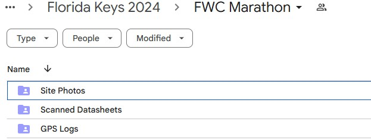
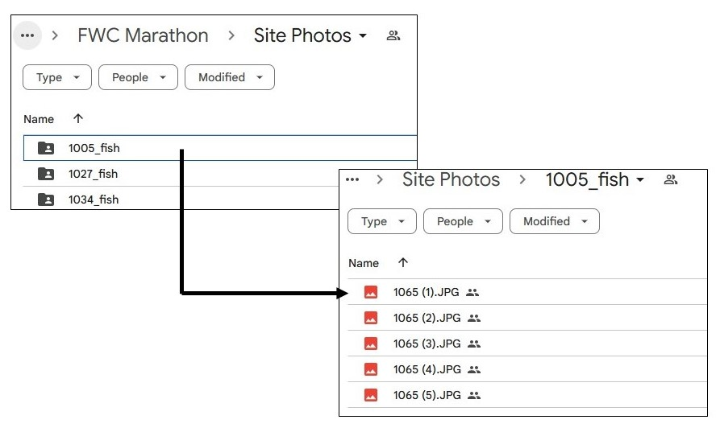
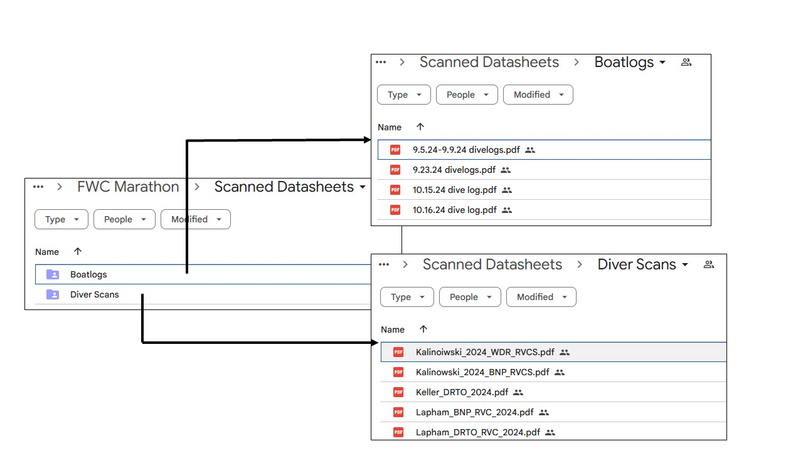

# Google Drive Uploads {.tabset}

> Photos, scanned datasheets and GPS logs should be uploaded to the appropriate Google Drive folder.
>
> You will be given a link for your specific agency/group in the **'NCRMP - All participant access'** directory containing 3 additional folders

 

## Site Photos

This directory should have a folder named as site#\_fish or site#\_benthic containing at least 5 photos

-   Datasheet showing fieldid and date
-   4 cardinal direction photos

{width="671"}

## Scanned Datasheets

This directory contains a folder for scanned boatlogs/diverlogs and diver datasheets

-   boatlogs/divelogs should be named as the date or range of dates
-   diver datasheets can be scanned together (ordered by date and time) named as diver_sample type

## GPS Logs

This directory contains all the Lat/Lon locations from the flag GPS.  This could be in a number of formats, but should be in a way that is easy to find a coordinate from a specific date and time or siteID.

- text file or excel spreadsheet
- the entire tracklog or one line per site with flag coordinates